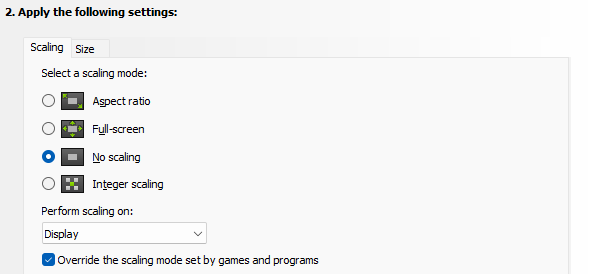

# 🪟 Install software on Windows

PowerShell [script](/install-tools/windows/setup-script.ps1). `winget` first needs to set 2-letter geographic region before running this script, unfortunately, running the script itself doesn't prompt the user. First, run a command similar to this and accept the T&Cs:

```powershell
winget list
```

Run the following command to invoke the script:

```powershell
Invoke-WebRequest https://raw.githubusercontent.com/ka5p3rr/pc-setup/main/install-tools/windows/setup-script.ps1 | Invoke-Expression
```

## DisplayFusion

Load configuration from backup.

## NVIDIA Control Panel

Adjust display scaling.


